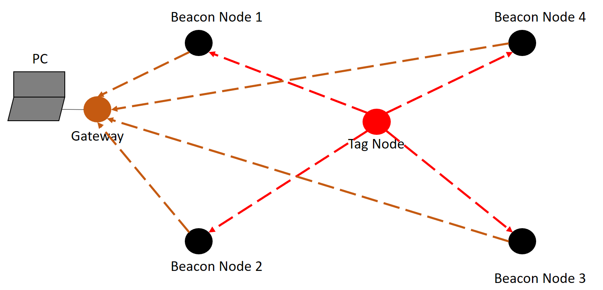
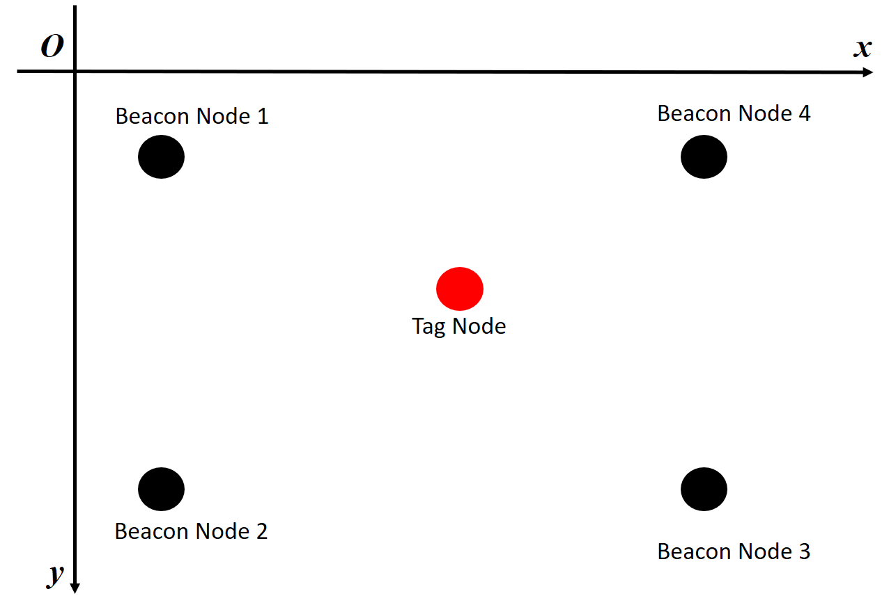

# CIC-localization
The localization system is divided into two parts, the hardware and software. The hardware composes of the beacon nodes, the gateway, and the tag node. The software composes of the environment configuration, the GUI, and the localization core. In the following, we will introduce them one by one.

## Hardware
The hardware deployment is shown in the following figure. In the system, there are one PC, one tag node, one gateway, and several beacon nodes.

### Beacon nodes
The beacon nodes are deployed as anchor points for localization. Each beacon node acts as follows:
*	Receive signals (red dashed lines) sent from tag node;
*	Evaluate distance between itself and the tag node; and
*	Send the evaluated distance (brown dashed lines) to the gateway.

### Gateway
The gateway acts as the manager to gather relative distance between the tag node and each beacon node. It continuously receives the relative distance (the brown dashed lines) sent from each beacon node and write to the COM port of the computer which it is plugged into.

### Tag Node
The tag node is the node we want to localize. It periodically broadcast signals (the red dashed lines) which can be used to calculate distance.

## Software

### Environment Configuration
On our personal computer, we have to configure the software to fit it into our localization system. The file we have to modify is “setting.conf”. In the file, we have to modify two parts, namely [serial] and [anchor]. For the [serial], the variable serial_name should be set as the COM port which the gateway is plugged in. The default value is com3 in our system. For the [anchor], the variable anchor_setting record the position of each anchor point. We should set the coordinate of each beacon node as in the real world. The relative positions of the four beacon nodes are shown in the following figure.

### Serial Controller
The serial controller is responsible for receiving distance data from the beacon nodes and converting it into easy-to-use data. The distance data is represented as (tagID, beaconID, distance, RSS, sequence number) with the data types of (32-bit integer, 32-bit integer, single-precision float, 32-bit integer, 32-bit integer). The data is then passed to the localization core. The main file is serialcontroller.py.

### Localization Core
Since the distance data received by the gateway may be inaccurate. We should apply some algorithm to filter the data and get relatively accurate position of the tag node. This is the role that the localization core plays. The technic used in our system is Kalman filter. The main file is kalmanfilter.py.

### Location Plotter
When the Kalman filter is used in the system, we can get a relatively accurate position. The position will be passed to the location plotter. The main file is locationplot.py. When a position is passed to it, it will save the position to a local file, and plot a small rectangle on the GUI. If the number of historical position is larger than a threshold, it will clear half of the positions.

